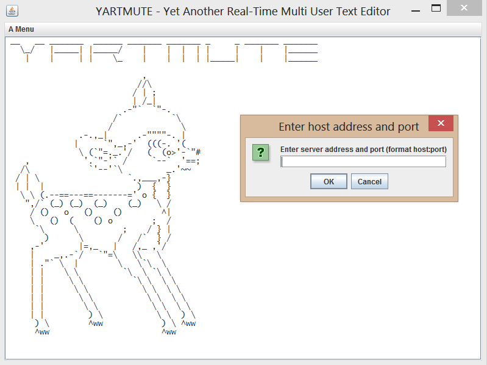
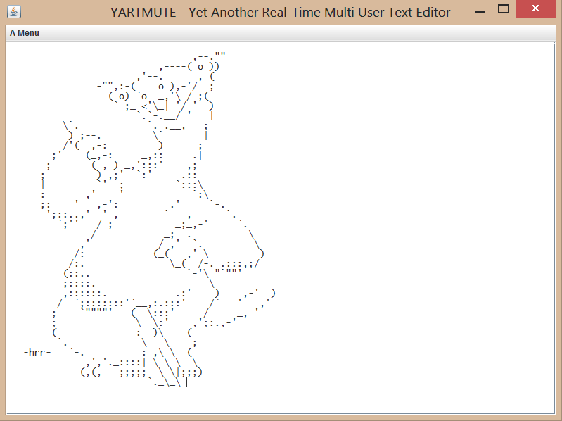

```
__   __ _______  ______ _______ _______ _     _ _______ _______
   \_/   |_____| |_____/    |    |  |  | |     |    |    |______
    |    |     | |    \_    |    |  |  | |_____|    |    |______
                            ,
                           //\
                          / | ;
                          | /_|
                        .-"`  `"-.
                      /`          `\
                     /              \
               .-.,_|      .-""""-. |
              |     `",_,-'  (((-. '(
               \ (`"=._.'/   (  (o&gt;'-`"#
    ,           '.`"-'` /     `--`  '==;
   /\\            `'--'`\         _.'~~
  / | \                  `.,___,-}
  | |  |                   )  {  }
   \ \ (.--==---==-------=' o {  }
    ",/` (_) (_)  (_)    (_)   \ /
     / ()   o   ()    ()        ^|
     \   ()  (    () o        ;  /
      `\      \         ;    / } |
        )      \       /   /`  } /
     ,-'       |=,_   |   /,_ ,'/
     |    _,.-`/   `"=\   \\   \
     | ."` \  |        \   \`\  \
     | |    \ \         `\  \ `\ \
     | |     \ \          `\ \  \ \
     | |      \ \           \ \  \ \
     | |       \ \           \ \  \ \
     | |        \ \           \ \  \ \
     | |         ) \           \ \  ) \
 jgs `) \        ^ww            ) \ ^ww
      ^ww                       ^ww
```

# Yet Another Real-Time Multi-User Text Editor

## Quick guide

### 1. Ladda ner
[yartmute.zip](jar_files/yartmute.zip) Innehåller server- och klientprogrammet samt källkod

[Java runtime edition 7](http://www.oracle.com/technetwork/java/javase/downloads/java-se-jre-7-download-432155.html) eller nyare

[Projektrapport](jar_files/EDA095Projektrapport.pdf)
		
### 2. Starta servern
```
java -jar server.jar [portnr] [folder]
folder är mappen med editerbara textfiler. OBS: Filerna ska avslutas med \END\
```

### 3. Starta klienter

* Klicka på client.jar
		
## Översikt över resultatet
				
YARTMUTE är en texteditor där flera användare samtidigt kan editera textfiler. 
Tänkbara användningsområden är ex. redigering av LaTeX-dokument eller ASCII-art. 



## Använda tekniker och mycket översiktlig design

Klienten och servern sätter upp en TCP-koppling där kommandon skickas i båda riktningar.
Kommandona är på en rad vardera som läses från/skrivs till byte-arrays med BufferedReaders/Writers. 
CommandFactory-klassen skapar kommandon från de mottagna strängarna. Uppdateringarna kan ske både tecken för tecken samt i större stycken. 
Klienten består av ett GUI samt klasser för läsning och skrivning på socketen. Programmet kör 3 trådar; en för GUI-t, en för skrivning, och en för läsning.
		
## Kortfattad utvärdering
Många problem uppstod längs vägen och det slutade med att endast grundläggande funktioner blev implementerade och programmet kräver ytterligare utveckling för att användas i större omfattning. En stor utmaning var att se till att alla användares ändringar blir rätt, även om de inte har samma version av dokumentet, vilket kan uppstå då flera personer ändrar samtidigt. 

Av: Elias Gabrielsson adi10ega, Niklas Strandberg, Johan Svensson &amp; Aron Söderling
